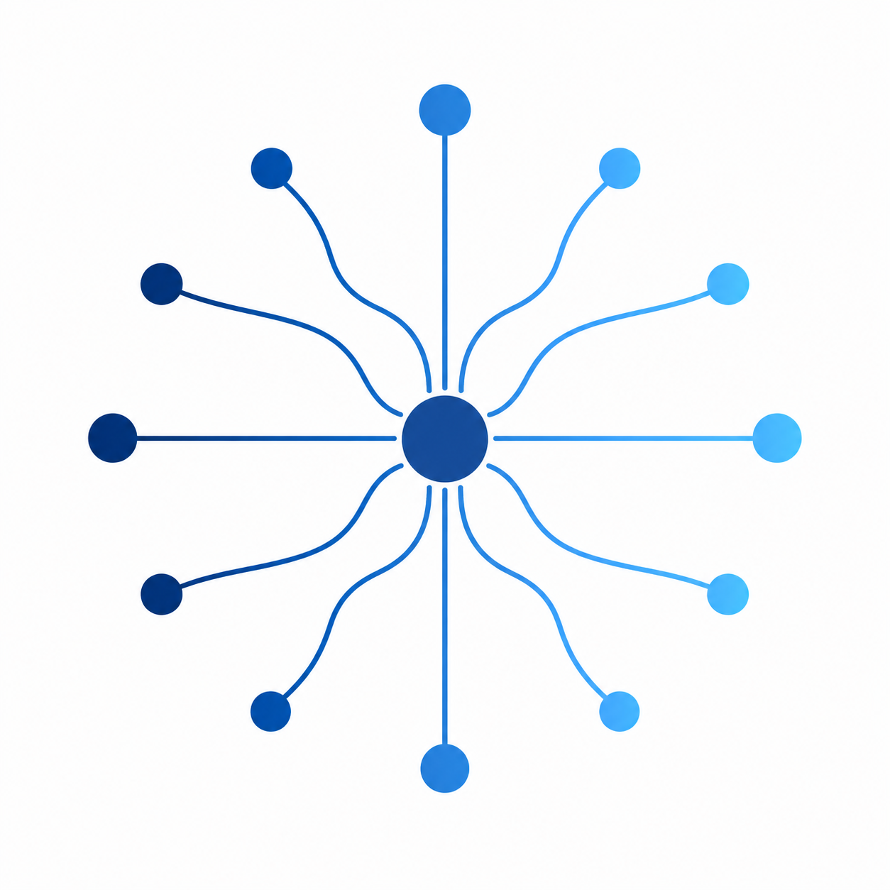

# Trendchaser

**AI 신호의 흐름을 위한 프리즘 — 잡음을 흩뜨리고, 의미 있는 것만 다시 모은다.**

<p align="center">
  
  
  
  
  &nbsp;
  
  
  
  
  
  
  
  &nbsp;
  
  
  
  
  &nbsp;
  
  
  
  
  
  
</p>

> *"다 읽는 건 불가능하고, 다 안 읽으면 진짜로 일어나고 있는 변화를 놓친다."*

[English README](./README.md) &nbsp;·&nbsp; [**taewoopark.com** — author site](https://taewoopark.com)

<p align="center">
  
</p>

---

> **본 레포는 Trendchaser의 기술 리포트입니다.**
> 실제 서빙되는 실시간 정보들은 카카오톡 오픈채팅방에서 확인할 수 있습니다 (익명 가입 가능):
> **→ https://open.kakao.com/o/pfQMgHsi**
>
> 구현 소스는 비공개입니다. 본 레포는 설계·소스·파이프라인을 문서화합니다.

---

## 목차

1. [받는 사람의 입장에서](#받는-사람의-입장에서)
2. [왜 prism인가](#왜-prism인가)
3. [어떻게 도착하는가](#어떻게-도착하는가)
4. [Architecture](#architecture)
5. [파이프라인 단계](#파이프라인-단계)
6. [소스 카탈로그](#소스-카탈로그)
7. [점수화 공식](#점수화-공식)
8. [기술 스택](#기술-스택)
9. [장애 모드 & 회복력](#장애-모드--회복력)
10. [출력 포맷](#출력-포맷)
11. [Telemetry & 검증](#telemetry--검증)
12. [설계 원칙](#설계-원칙)
13. [Author](#author)

---

## 받는 사람의 입장에서

하루 네 번, 짧은 뉴스 브리프가 폰으로 도착한다. 한 항목은 굵은 헤드라인 한 줄과 3–5문장의 줄글, 그리고 출처 링크.

```
🤖 AI

Anthropic, 새 모델 SDK 공개

Anthropic이 자체 에이전트 SDK를 정식 공개했다. 기존 API
위에서 도구 호출과 메모리를 한 단계 추상화한 것으로, ...
(출처: anthropic_news — https://anthropic.com/news/... — 2시간 전)

🌐 General

...
```

신문 읽듯 읽으면 된다. 직접 돌리는 건 아무것도 없다.

---

## 왜 prism인가

프리즘은 백색광 안에 이미 들어 있던 스펙트럼을 **분산**시켜 보여 주고, 두 번째 프리즘이 그중 필요한 파장만 다시 **수렴**시켜 쓸 수 있는 빛으로 만든다.

Trendchaser는 당신의 일일 AI/Dev 피드에 대해 그 두 번째 프리즘 역할을 한다.

```
   sources ──┐
   sources ──┤        ╱╲          ╲   ╱
   sources ──┼──────▶ ╱  ╲ ──────▶ ╲ ╱ ──▶  brief
   sources ──┤       ╱    ╲        ╳
   sources ──┘      ╱──────╲      ╱ ╲
                  분산 + 점수화      수렴
```

---

## 어떻게 도착하는가

하루 네 슬롯 (KST).

| 슬롯 | 시각 | Lookback 창 | 구성 |
|---|---|---|---|
| **morning** | 10:00 | 직전 13시간 | AI 5 + general 3 |
| **afternoon** | 14:00 | 직전 5시간 | AI 3 + general 2 |
| **evening** | 18:00 | 직전 5시간 | AI 3 + general 2 |
| **night** | 22:00 | 직전 5시간 | AI 3 + general 2 |

Lookback 창은 슬롯 간격에 맞춰 한 기사가 최대 한 브리프에만 들어가도록 튜닝되어 있다. 14일 누적 dedup으로 소스 단계에서 중복을 제거한다. 한 소스가 죽어도 나머지는 그대로 송출된다.

---

## Architecture

```
                ┌──────────────────────────────────────────────────────────────┐
                │                Claude Code Routine (cloud)                    │
                │  cron at 10:00 / 14:00 / 18:00 / 22:00 KST                            │
                └──────────────────────────────────────────────────────────────┘
                                          │
                                          ▼
   ┌────────────────────────────────────────────────────────────────────────┐
   │                        12-step curation routine                        │
   │   prompts/curate.md를 routine 안 Claude가 step-by-step 실행            │
   └────────────────────────────────────────────────────────────────────────┘
        │           │             │             │             │
        ▼           ▼             ▼             ▼             ▼
   ┌────────┐  ┌─────────┐  ┌──────────┐  ┌──────────┐  ┌──────────┐
   │ fetch_ │→ │ dedupe  │→ │ enrich   │→ │ Claude   │→ │ deliver  │
   │ all.py │  │ .py     │  │ .py      │  │ scoring  │  │ .py      │
   │        │  │         │  │          │  │ + write  │  │          │
   │ 9 fet- │  │ seen    │  │ trafila- │  │ (Step 6– │  │ Telegram │
   │ chers  │  │ .json   │  │ tura top │  │ 8 of     │  │ + Notion │
   │ paral- │  │ + within│  │ 30 body  │  │ curate)  │  │          │
   │ lel    │  │ batch   │  │ extract  │  │          │  │          │
   └────────┘  └─────────┘  └──────────┘  └──────────┘  └──────────┘
        │           │             │             │             │
        ▼           ▼             ▼             ▼             ▼
   raw items    deduplicated   enriched      brief md     Telegram chat
                items          items                      → KakaoTalk relay
                                                          → Notion archive
                                                          → Obsidian vault
                                                            (auto-pull
                                                             claude/brief-stream)
```

Two-branch 게시 전략: `state/seen.json`은 `main`에 (다음 routine이 최신 dedup 상태를 봄), 브리프는 `claude/brief-stream`에 누적되어 Obsidian이 그 브랜치만 follow.

---

## 파이프라인 단계

### 1. Fetch — `scripts/fetch_all.py`

10+ fetcher 타입 (`rss`, `atom`, `arxiv`, `hn`, `youtube`, `hf_papers`, `hf_models` [trending/new mode], `github_trending`, `sitemap`, `gmail_newsletter`, `vercel_x`)을 병렬 수집. 소스별 `RateLimiter` (arxiv 3.0초, 그 외 0.2초 default). `ThreadPoolExecutor(max_workers=5)`. 각 fetcher는 `list[Item]`을 반환하고 raise 금지 — 실패는 orchestrator의 `failures[]` 배열로 수집.

URL canonicalization은 `canonicalize_url`(UTM/tracking 파라미터 제거, host 소문자, 끝 슬래시 정규화). Title은 NFKD + 소문자 + 공백 정규화. Item ID = `sha1(canonical_url)[:40]`.

### 2. Deduplicate — `scripts/dedupe.py`

3단 dedup:

1. **영구 dedup** — `state/seen.json`이 최근 14일 모든 item ID + `title_norm` 보유. 둘 중 하나만 매치해도 신규 item drop.
2. **소스 간 batch 내부** — 같은 `id` 또는 `title_norm`가 여러 소스에서 등장하면 weight 최고치 1개만 유지.
3. **브리프 history dedup** — Claude가 최근 14일치 `briefs/*.md`를 스캔해 `title_norm` substring 또는 URL canonical 매치 검사. Jaccard ≥ 0.6 → freshness penalty −100 (사실상 drop).

### 3. Enrich — `scripts/enrich.py`

Pre-rank: `(weight × normalized score) + 0.3 × normalized velocity`로 정렬해 상위 30개 선택. 트렌딩 소스(`github_trending_*`, `hf_models_trending`)에는 **novelty multiplier**를 곱해 오래된 repo의 단발성 hype를 페널티화한다 — `created_at` 기준 ≤7d 1.3× / ≤30d 1.0× / ≤90d 0.7× / >90d 0.4×. 각 항목에 대해 `trafilatura.fetch_url + extract`로 본문 추출, 1500자로 truncate해 `body_excerpt`에 저장. Fail-open: 항목별 try/except, 실패 시 `body_excerpt=""`.

`SKIP_TRAFILATURA_SOURCES = {arxiv_ai, youtube_ai, hf_papers, hf_models_trending, hf_models_new, github_trending_*}` — 이 소스들은 upstream summary가 DOM 추출보다 정확하므로 우회.

`ThreadPoolExecutor(max_workers=8)`. 실측 wall-time ≈ 3초 (top-30 기준).

이후 **Shortlist 단계** (`scripts/shortlist.py`)에서 트렌딩 소스 cap을 강제: AI 섹션 최대 2개, General 섹션 최대 1개. "오래 누적된 trending이 brief를 잠식"하는 패턴을 구조적으로 차단한다.

### 4. Score — `prompts/curate.md` Step 6

routine 안 Claude가 `profile.md`(큐레이션 프로필)를 읽고 항목별 합성 점수 계산. 2026-05-04 개정으로 **novelty axis가 추가된 6-axis 시스템**:

```
score = 0.25·signal + 0.25·affinity + 0.20·recency + 0.20·novelty + 0.05·velocity + 0.05·freshness
```

요소 정의:
- **signal** — `source_weight × normalized(source_score)`. 점수 없는 소스는 weight만 사용 (0.6 base).
- **affinity** — title + body excerpt와 `profile.md`의 Priorities / AI Keywords / Boost의 의미적 매치도.
- **recency** — 시간 단위 점감: ≤3h → 100, ≤6h → 85, ≤12h → 65, ≤24h → 40, >24h → 15.
- **novelty** — "이게 진짜 처음 발신되는 신호인가?"의 척도. 트렌딩 piggyback과 1차 발신을 구분한다.
  - 1차 발신처(lab 블로그 / release.atom / 논문 / firehose) → 100
  - 큐레이터·집계 채널 → 65
  - 트렌딩(이미 존재하던 artifact의 재부각) → `created_at` 기준 점감 (≤7d 80 / ≤30d 50 / ≤90d 25 / >90d 0)
- **velocity** — HN/HF 점수 증가율 정규화 (없으면 0.5 base).
- **freshness** — 최근 14일 브리프 본문 매치 시 페널티.

**Hard cutoff** (점수 무관 즉시 제외): `profile.md` `Mute` 매치 · `published_at > 24h` (단, `signal+affinity` 평균 ≥ 80인 evergreen 신호는 예외 — "어제 등장" 명시) · 최근 14일 브리프에 동일 URL 또는 ≥0.6 유사 제목 등장.

### 5. Write — `prompts/curate.md` Step 7–8

슬롯별 선정 (소스 다양성 가드: `source_id` 당 섹션 최대 2개):
- morning: AI 5 + general 3
- afternoon, evening: AI 3 + general 2

각 항목은 **2-블록 구조**: 굵은 한 줄 헤드라인 (8–18자, 신문 헤드라인 톤) → 빈 줄 → 3–5문장 줄글 단락이 `(출처: {source_id} — {bare_url} — {N시간 전})`로 닫힘. Bare URL 의무 — Telegram→KakaoTalk relay에서 hyperlink는 라벨만 복사돼 URL이 사라지는 것을 방지.

### 6. Deliver — `scripts/deliver.py`

`md_to_telegram_html`은 placeholder→escape→restore 패턴 (허용 태그: `b`, `i`, `code`, `a`, `blockquote`). markdown heading → bold 줄, bullet → `• ` 접두. 출력은 ≤ 3800자 chunk로 split (paragraph 단위 → line 단위 → hard-split).

`strip_outbound_footer`가 outbound 메시지에서 `## 📌 다음 슬롯…` 예고, `---`, `*Failed sources*`, `*Diagnostics*`를 제거 — 브리프 파일과 Notion archive에는 history로 남는다.

선택적 Notion archive: `notion_blocks.markdown_to_notion_blocks`로 `heading_1..3`, `bulleted_list_item`, `numbered_list_item`, `quote`, `paragraph` (1900자 split) + inline `link/bold/italic/code` rich_text로 변환. Page property: Title, Date, Slot, Sources (multi_select).

KakaoTalk relay는 Telegram의 downstream — 브리프 안 bare URL이 Android 클립보드 hop을 살아남는다.

---

## 소스 카탈로그

`sources.yaml`(비공개 운영 레포)에 정의된 70+ 피드. 2026-05-04 개정에서 "최최신 신호"를 강하게 잡기 위해 release.atom firehose와 새 fetcher 모드를 다수 추가. Weight와 파라미터:

### AI Trend Primary

| ID | Type | Weight | Parameters |
|---|---|---|---|
| `hf_papers` | HuggingFace Daily Papers | **1.7** | 2일 lookback, min_upvotes=15 |
| `hf_models_new` | HuggingFace Models (firehose) | **1.5** | 2026-05-04 신설. 각 foundation lab을 author 필터로 순회 → `createdAt desc` 최신 N개. 7일 윈도우 컷. min_likes/downloads=0. |
| `github_trending_python` | GitHub Trending | 1.4 | language=python, since=daily, top 25 |
| `github_trending_overall` | GitHub Trending | 1.3 | 전체 언어, since=daily, top 15 |
| `hf_models_trending` | HuggingFace Models | 0.9 | 2026-05-04 강등 (1.3 → 0.9). 누적 인기 신호라 신선도 약함. `hf_models_new`로 분담. |

**Foundation lab whitelist**: 2026-05-04에 31개 추가 — Western (CohereForAI, BlackForestLabs, NousResearch, apple, RekaAI, ai21labs, tiiuae, EleutherAI, bigscience, bigcode, Salesforce, ServiceNow, HuggingFaceH4/TB, Nexusflow), Chinese (moonshotai, Skywork, ZhipuAI, IEITYuan, StepFun-AI, 01-ai, THUDM, OpenBMB, internlm, baichuan-inc, Tencent, Alibaba-NLP, ByteDance), Korean (naver-hyperclovax, kakaocorp). 비-서구 lab에는 score 1.15× boost.

### AI Lab Direct

| ID | Type | Weight | Feed |
|---|---|---|---|
| `anthropic_news` | RSS | **1.6** | anthropic.com/news/rss.xml |
| `openai_blog` | RSS | 1.5 | openai.com/blog/rss.xml |
| `meta_ai` | RSS | 1.4 | ai.meta.com/blog/rss/ — FAIR / Llama / SAM |
| `googleai_blog` | RSS | 1.3 | blog.google/technology/ai/rss/ |
| `deepmind_blog` | RSS | 1.3 | deepmind.google/blog/rss.xml |
| `huggingface_blog` | RSS | 1.3 | huggingface.co/blog/feed.xml |
| `mistral` | RSS | 1.3 | mistral.ai/news/feed.xml |

### Curators & AI Newsletters

| ID | Type | Weight | Feed |
|---|---|---|---|
| `simonwillison` | RSS | 1.4 | simonwillison.net/atom/everything/ |
| `import_ai` | RSS | 1.4 | importai.substack.com/feed — Jack Clark 주간 digest |
| `latent_space` | RSS | 1.3 | latent.space/feed |
| `interconnects` | RSS | 1.3 | interconnects.ai/feed |
| `smol_ai` | RSS | 1.2 | buttondown.email/ainews/rss |

### Open Source Releases (Atom firehose)

GitHub `releases.atom`은 푸시 직후 갱신되는 사실상 실시간 피드 — release 이벤트가 1차 발신되는 가장 빠른 자리. 2026-05-04 개정에서 LLM 인프라·에이전트 프레임워크·MCP SDK 14개를 한꺼번에 보강.

| ID | Type | Weight | Feed |
|---|---|---|---|
| `claude_code_releases` | Atom | **1.5** | anthropics/claude-code |
| `mcp_releases` | Atom | 1.3 | modelcontextprotocol/specification |
| `mcp_python_sdk_releases` | Atom | 1.6 | modelcontextprotocol/python-sdk |
| `mcp_typescript_sdk_releases` | Atom | 1.6 | modelcontextprotocol/typescript-sdk |
| `openai_python_releases` | Atom | 1.6 | openai/openai-python |
| `openai_agents_releases` | Atom | 1.6 | openai/openai-agents-python |
| `openai_swarm_releases` | Atom | 1.5 | openai/swarm |
| `transformers_releases` | Atom | 1.6 | huggingface/transformers |
| `accelerate_releases` | Atom | 1.5 | huggingface/accelerate |
| `diffusers_releases` | Atom | 1.5 | huggingface/diffusers |
| `peft_releases` | Atom | 1.5 | huggingface/peft |
| `vllm_releases` | Atom | 1.6 | vllm-project/vllm |
| `ollama_releases` | Atom | 1.6 | ollama/ollama |
| `llamacpp_releases` | Atom | 1.6 | ggml-org/llama.cpp |
| `langchain_releases` | Atom | 1.5 | langchain-ai/langchain |
| `autogen_releases` | Atom | 1.5 | microsoft/autogen |

### 한국 AI 생태계

| ID | Type | Weight | Feed |
|---|---|---|---|
| `upstage_blog` | RSS | 1.2 | upstage.ai/blog/rss.xml — Solar 모델, document AI |
| `lg_ai_research` | RSS | 1.1 | lgresearch.ai/blog/rss.xml — EXAONE |
| `naver_d2` | Atom | 1.0 | d2.naver.com/d2.atom — CLOVA / HyperCLOVA |
| `kakao_tech` | RSS | 1.0 | tech.kakao.com/feed/ — Kakao Brain |

### Raw Database

| ID | Type | Weight | Parameters |
|---|---|---|---|
| `arxiv_ai` | arXiv API | 0.8 | categories=cs.AI/cs.LG/cs.CL/stat.ML, max_results=40, sort=submittedDate desc, rate_limit=3.0s |

### Aggregators

| ID | Type | Weight | Parameters |
|---|---|---|---|
| `hn_top` | Hacker News (Algolia, popularity) | 1.2 | tags=story, ai_min_points=120 / general_min_points=150, min_num_comments=20, lookback=30h |
| `hn_breaking` | Hacker News (Algolia, by date) | **1.4** | 2026-05-04 신설. `/api/v1/search_by_date` 기반 4시간 firehose. AI 키워드 매치 시 75pt 임계로 초기 모멘텀 잡음. |
| `techmeme` | RSS | 0.7 | techmeme.com/feed.xml (rumor·정치 누수로 1.0 → 0.7 강등) |
| `producthunt` | RSS | 0.5 | producthunt.com/feed, max_items=15, min_votes=300 |

`hn_top`은 누적 점수(이미 화제), `hn_breaking`은 4시간 안의 초기 모멘텀(곧 화제). 두 채널이 시간 축에서 직교한다.

### X 큐레이션 (제한적)

직접 큐레이션한 follow 리스트와 일부 lab 공식 계정에서 12시간 lookback으로 최근 게시물을 수집. 정식 X API는 사용하지 않으며, 별도 자체 호스팅 mini-relay를 거쳐 raw 텍스트만 가져온다 — 라이브 firehose가 아니라 슬롯별 스냅샷이라는 한계는 있지만, lab 발표가 블로그보다 X에 먼저 뜨는 케이스를 일부 메운다. 큐레이션은 사용자의 follow 리스트 자체에 위임 — 채널 회전 시 코드 수정 없이 follow만 갱신.

### Longform & Essays

| ID | Type | Weight | Feed |
|---|---|---|---|
| `oneusefulthing` | RSS | 1.3 | oneusefulthing.org/feed — Ethan Mollick, 응용 AI 에세이 |
| `pragmaticengineer` | RSS | 1.2 | newsletter.pragmaticengineer.com/feed — Gergely Orosz, 소프트웨어 엔지니어링 longform |
| `thebrowser` | Gmail Newsletter | 1.4 | label=Newsletter, from=caroline@thebrowser.com |
| `notboring` | Gmail Newsletter | 1.2 | label=Newsletter, from=packy@notboring.co |

### Meta-Source

| ID | Type | Weight | Feed |
|---|---|---|---|
| `lesswrong` | RSS | 1.1 | lesswrong.com/feed.xml?karmaThreshold=60, max=15 |
| `alignment_forum` | RSS | 1.0 | alignmentforum.org/feed.xml?karmaThreshold=20, max=10 |

### YouTube

| ID | Type | Weight | Channels |
|---|---|---|---|
| `youtube_ai` | YouTube RSS | 0.9 | Yannic Kilcher · Andrej Karpathy · Two Minute Papers · Latent Space · Dwarkesh Patel · Lex Fridman (채널당 4개, 48h lookback) |

**AI 분류 규칙** — `{hf_papers, hf_models_trending, arxiv_ai, anthropic_news, openai_blog, googleai_blog, deepmind_blog, huggingface_blog, meta_ai, mistral, simonwillison, latent_space, interconnects, smol_ai, import_ai, alignment_forum, github_trending_python, github_trending_overall, oneusefulthing, claude_code_releases, mcp_releases, upstage_blog, lg_ai_research}` 출처는 정의상 AI. 그 외 출처도 title + body excerpt가 `profile.md` AI Keywords와 강하게 매치되면 AI; 아니면 general.

---

## 점수화 공식

`prompts/curate.md` Step 6에서 routine 안 Claude가 항목별로 계산. **2026-05-04 개정으로 novelty axis 도입한 6-axis 시스템**:

```
total = 0.25·signal       (source_weight × normalized source score)
      + 0.25·affinity     (profile.md와의 의미 매치)
      + 0.20·recency      (시간 단위 점감 step function)
      + 0.20·novelty      (1차 발신 vs 트렌딩 piggyback 구분)
      + 0.05·velocity     (정규화된 HN/HF velocity)
      + 0.05·freshness    (14일 브리프 중첩 페널티)
```

Recency step function:

```
hours since publish    score
        ≤ 3              100
        ≤ 6               85
        ≤ 12              65
        ≤ 24              40
        > 24              15
```

Novelty mapping:

```
source class                          score
1차 발신 (lab 블로그·release.atom·     100
  hf_papers·hn_breaking·x_lab)
큐레이터 / aggregator                  65
트렌딩 (artifact 재부각)               age 의존
  ≤7일                                  80
  ≤30일                                 50
  ≤90일                                 25
  >90일                                  0
arxiv (후행 raw DB)                    50
```

이 axis는 "GitHub trending 1위지만 사실 2년 전 repo가 단발 hype를 받는 것"과 "방금 nvidia가 release를 푸시한 것"을 정량적으로 구분한다. 트렌딩 1.0× / 1차 발신 1.6× 효과.

**구조적 cap** (Step 7 shortlist): 트렌딩 소스(`github_trending_*`, `hf_models_trending`)는 AI 섹션 2개 / General 섹션 1개로 hard cap. Step 8(브리프 작성) 이전에 강제되므로 "오래된 trending이 brief를 잠식"하는 패턴이 코드 단계에서 차단된다.

선정 임계값: AI 항목 점수 < 60이면 drop 또는 인원 축소; general 항목 점수 < 50이면 General 섹션 자체 생략. 소스 다양성 가드: `source_id` 당 섹션 최대 2개.

---

## 기술 스택

| 레이어 | 선택 | 이유 |
|---|---|---|
| Runtime | **Python 3.11+**, 모든 모듈 상단에 `from __future__ import annotations` | type hint·dataclass 기반, Claude Code Routine 클라우드 환경에서 사용 가능 |
| Orchestrator | **Claude Code Routines** on cloud | cron 구동, 매 실행마다 fresh repo clone, 네이티브 `git push` 권한 |
| 병렬성 | **`concurrent.futures.ThreadPoolExecutor`** (fetch 5, enrich 8) | I/O bound — thread로 충분, asyncio 복잡도 회피 |
| RSS / Atom | **`feedparser` ≥ 6.0.10** | 깨진 피드에 관대, Atom/RSS 변종 정규화 |
| HTML 추출 | **`trafilatura` ≥ 1.12** + `BeautifulSoup4` + `lxml` | 오픈소스 기사 본문 추출에서 정밀도 최상위 |
| HTTP | **`requests` ≥ 2.31** + 20초 default timeout | 호출별 timeout, 구조화된 에러 처리 |
| Time | **`python-dateutil` ≥ 2.8** | ISO-8601 + RFC-822 강건 파싱 |
| Config | **`pyyaml` ≥ 6.0** for `sources.yaml` and `profile.md` | 사람이 직접 편집, push-to-deploy |
| Delivery | **Telegram Bot API** (HTML mode, sendMessage) + **Notion API** (`notion-client` ≥ 2.2) | Telegram = push, Notion = archive — 둘 다 무료 |
| Brief 작성 | **routine 안 Claude**가 `prompts/curate.md` Step 6–8 수행 | LLM은 affinity 점수 + 산문 작성을 담당, 결정론적 Python이 그것을 감쌈 |
| Storage | Two-branch git: `main`에 `state/seen.json`, `claude/brief-stream`에 `briefs/*.md` + `state/raw/*.json` | race-safe dedup state + Obsidian-followable archive |
| KakaoTalk relay | Android-side relay가 Telegram 메시지를 forward | 카카오 오픈채팅 push의 공식 API 부재 |

유료 API 없음. OpenAI key 없음. 벡터 DB 없음. 외부 점수화 서비스 없음. 의도적으로 가볍고 작다.

---

## 장애 모드 & 회복력

| 장애 | 동작 |
|---|---|
| 소스 5xx / timeout | fetcher가 `[]` + warning log 반환. orchestrator가 `failures[source_id]` 기록. 다른 소스는 계속. |
| arXiv rate limit (3s/req) | 소스별 `RateLimiter`가 inter-request delay 강제. |
| HuggingFace API schema 변경 | `hf_papers` URL을 canonical `arxiv.org/abs/...`로 정규화해 `arxiv_ai`와 cross-source dedup 정상 동작. |
| Telegram chunk 송신 실패 | per-chunk try/except + 1회 retry with backoff. 실패 chunk가 다음 chunk 차단 안 함. |
| Notion API 5xx | log 후 진행. Telegram은 그대로 송출. Notion archive는 best-effort. |
| Gmail 자격증명 부재 | `gmail_newsletter` fetcher가 `[]` + info log 반환. |
| YouTube 채널 ID 404 | 채널별 try/except, `youtube_ai`의 다른 채널은 계속. |
| Routine repo race | routine이 push 전 `--rebase` pull 수행; brief-stream은 main에서 ff-only merge. |
| enrich 단일 URL 실패 | 항목별 try/except, `body_excerpt=""`로 두고 점수화 계속. |
| env 변수 부재 (TELEGRAM_*) | `deliver.py`가 warning + exit 0 (routine을 죽이지 않음). |

---

## 출력 포맷

브리프 markdown 구조 (`briefs/$DATE-$SLOT.md`):

```markdown
# Trendchaser: 4월 30일 10시 기준 최신 AI/Dev 소식

> 생성 2026-04-30 10:02 KST · 직전 슬롯 이후 13시간 스캔 · raw 201 → dedup 190 → 선정 8

## 🤖 AI

**Anthropic, 새 모델 SDK 공개**

Anthropic이 자체 에이전트 SDK를 정식 공개했다. ...
(출처: anthropic_news — https://www.anthropic.com/news/agent-sdk — 2시간 전)

(2–4 추가 항목, 각 항목 사이 빈 줄 1개)

## 🌐 General

(1–2 항목, 동일 포맷)

## 📌 다음 슬롯에서 확인할 것

(50–60점대 대기 항목 한 단락, 또는 섹션 생략)

---
*Failed sources: 없음*
*Diagnostics: top_signal=anthropic_news(2.43), oldest_picked=8h ago*
```

Telegram outbound 메시지에서는 `## 📌` 예고 섹션과 diagnostics 푸터가 strip된다 (`strip_outbound_footer`). 브리프 파일과 Notion archive는 history 보존을 위해 그대로 유지.

---

## Telemetry & 검증

Phase-09 dry-run 검증 (live credential 없이 측정):

| Test | 결과 |
|---|---|
| Scenario A — full fetch (morning slot, env 부재) | **201 items, 17 active sources, failures 0** |
| Scenario B — fetch_all/dedupe/enrich/deliver chain | 각 step `exit 0` |
| Scenario C — `hf_papers + reddit_ml` 비활성화 | 다른 16 소스 계속, **166 items** |
| Scenario D — 동일 score, 다른 velocity | fresh velocity 우선 (1.300 vs 1.006) |
| top-30 enrichment wall time | ≈ 3초 |
| `tests/test_delivery.py` | **14/14 pass** (escape, underscore 링크, chunk paragraph split, hard split, notion blocks, env-missing exit 0) |
| arxiv body 추출 일치율 (summary == body_excerpt) | 37/37 = **100%** |
| Telegram self-test (HTML escape, no double-escape, underscore URL 링크) | pass |

라이브: routine이 매일 KST 10:00 / 14:00 / 18:00 / 22:00에 실행; 첫 sample 브리프는 단일 3478자 Telegram chunk로 송출됨.

---

## 설계 원칙

- **뉴스 브리프 톤, LinkedIn 톤이 아님.** 헤드라인 + 3–5문장 줄글. bullet 나열·"thought leadership"·"획기적인" 같은 공허한 형용사 없음.
- **시간 단위 신선도.** 3시간 전 기사가 어제 기사를 이긴다 — 어제 게 기술적으로 "더 적합"하더라도. 한물간 승리는 승리가 아니다.
- **누적 dedup.** 송출된 모든 브리프에 대한 14일 rolling window. 중복은 소스 단계에서 제거.
- **출처 URL 무결성.** 수집기가 실제로 모은 URL만. 합성·단축·검색 결과 대체 금지. 검증 실패 시 항목 자체 제외.
- **장애 격리.** HuggingFace 503이 GitHub trending 피드를 끌고 내려가지 않는다. 각 소스는 best-effort, 파이프라인은 가진 것을 송출한다.
- **Push to deploy.** `profile.md` 또는 `sources.yaml` 편집 후 `main`에 push하면 다음 슬롯부터 반영. 재시작·재배포 필요 없음.

---

## 진행 상태

라이브 운영 중. 매일 KST 10:00 / 14:00 / 18:00 / 22:00에 routine이 실행되어 위 KakaoTalk 오픈채팅으로 송출됩니다.

---

## Author

**Taewoo Park** — KAIST 물리학·수학과학 복수전공, KAIST Ultrafast Spin Dynamics Lab 연구 인턴. 물리·코드·문화를 정렬해 문명 단위의 솔루션으로 가는 길을 만든다.

<p align="center">
  <a href="https://taewoopark.com"></a>
  <a href="https://github.com/TaewoooPark"></a>
  <a href="https://x.com/theoverstrcture"></a>
  <a href="https://www.linkedin.com/in/taewoo-park-427a05352"></a>
  <a href="https://www.instagram.com/t.wo0_x/"></a>
  <a href="https://www.instagram.com/hustlyarchiv.kr/"></a>
  <a href="mailto:ptw151125@kaist.ac.kr"></a>
  <a href="https://open.kakao.com/o/pfQMgHsi"></a>
</p>

함께 만드는 다른 것들:
[NODEPROMPT](https://github.com/TaewoooPark/NODEPROMPT) &nbsp;·&nbsp; [PAIDEIA](https://github.com/TaewoooPark/PAIDEIA) &nbsp;·&nbsp; [PAIDEIA-codex](https://github.com/TaewoooPark/PAIDEIA-codex) &nbsp;·&nbsp; [taewoopark.com](https://github.com/TaewoooPark/taewoopark.com)

---

<p align="center">
  <sub>Trendchaser — 분산하고, 점수 매기고, 수렴한다.</sub>
</p>
