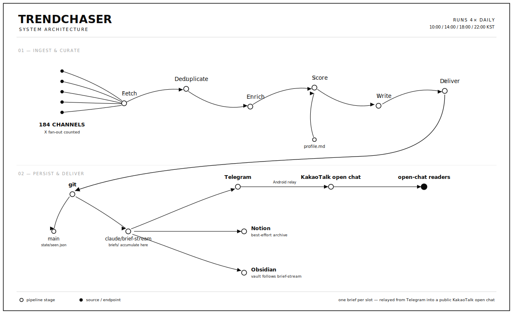

# Trendchaser

**AI 신호의 흐름을 위한 프리즘 — 잡음을 흩뜨리고, 의미 있는 것만 다시 모은다.**

<p align="center">
  
  
  
  
  &nbsp;
  
  
  
  
  
  
  
  &nbsp;
  
  
  
  
  &nbsp;
  
  
  
  
  
  
</p>

> *"다 읽는 건 불가능하고, 다 안 읽으면 진짜로 일어나고 있는 변화를 놓친다."*

[English README](./README.md) &nbsp;·&nbsp; [**taewoopark.com** — author site](https://taewoopark.com)

<p align="center">
  
</p>

---

> **본 레포는 Trendchaser의 기술 리포트입니다.**
> 실제 서빙되는 실시간 정보들은 카카오톡 오픈채팅방에서 확인할 수 있습니다 (익명 가입 가능):
> **→ https://open.kakao.com/o/pfQMgHsi**
>
> 구현 소스는 비공개입니다. 본 레포는 설계·소스·파이프라인을 문서화합니다.

---

## 목차

1. [받는 사람의 입장에서](#받는-사람의-입장에서)
2. [왜 prism인가](#왜-prism인가)
3. [어떻게 도착하는가](#어떻게-도착하는가)
4. [Architecture](#architecture)
5. [파이프라인 단계](#파이프라인-단계)
6. [소스 카탈로그](#소스-카탈로그)
7. [점수화 공식](#점수화-공식)
8. [기술 스택](#기술-스택)
9. [장애 모드 & 회복력](#장애-모드--회복력)
10. [출력 포맷](#출력-포맷)
11. [Telemetry & 검증](#telemetry--검증)
12. [설계 원칙](#설계-원칙)
13. [릴리즈 노트](#릴리즈-노트)
14. [Author](#author)

---

## 받는 사람의 입장에서

하루 네 번, 짧은 뉴스 브리프가 폰으로 도착한다. 한 항목은 헤드라인, 3-4개의 `▸` 라벨 bullet, 그리고 출처 링크를 갖춘 압축 topic card다. 웹 archive에는 더 긴 `DETAIL` 해설이 함께 남는다.

```
<!-- TG-SPLIT -->

## [AI] Anthropic, 새 모델 SDK 공개

▸ 무엇: Anthropic이 자체 에이전트 SDK를 정식 공개했다.
▸ 새 점: 기존 API 위에서 도구 호출과 메모리를 한 단계 추상화했다.
▸ 의의: agent workflow를 직접 엮던 팀의 glue code를 줄인다.
▸ 다음 행동: 기존 tool-calling wrapper와 SDK 경계를 비교할 만하다.

🔗 자세히: https://taewoopark.com/trendchaser/...
🔗 원문: https://anthropic.com/news/...
```

신문 읽듯 읽으면 된다. 직접 돌리는 건 아무것도 없다.

---

## 왜 prism인가

프리즘은 백색광 안에 이미 들어 있던 스펙트럼을 **분산**시켜 보여 주고, 두 번째 프리즘이 그중 필요한 파장만 다시 **수렴**시켜 쓸 수 있는 빛으로 만든다.

Trendchaser는 당신의 일일 AI/Dev 피드에 대해 그 두 번째 프리즘 역할을 한다.

```
   sources ──┐
   sources ──┤        ╱╲          ╲   ╱
   sources ──┼──────▶ ╱  ╲ ──────▶ ╲ ╱ ──▶  brief
   sources ──┤       ╱    ╲        ╳
   sources ──┘      ╱──────╲      ╱ ╲
                  분산 + 점수화      수렴
```

---

## 어떻게 도착하는가

하루 네 슬롯 (KST).

| 슬롯 | 시각 | Lookback 창 | 구성 |
|---|---|---|---|
| **morning** | 10:00 | 직전 13시간 | 최대 AI 6 + general 4 |
| **afternoon** | 14:00 | 직전 5시간 | 최대 AI 4 + general 3 |
| **evening** | 18:00 | 직전 5시간 | 최대 AI 4 + general 3 |
| **night** | 22:00 | 직전 5시간 | 최대 AI 4 + general 3 |

Lookback 창은 슬롯 간격에 맞춰 한 기사가 최대 한 브리프에만 들어가도록 튜닝되어 있다. 구성 수는 상한이지 채워야 하는 할당량이 아니다: 신선한 후보가 적으면 묵은 trending으로 채우지 않고 짧게 보낸다. 14일 누적 dedup으로 소스 단계에서 중복을 제거한다. 한 소스가 죽어도 나머지는 그대로 송출된다.

---

## Architecture

Claude Code routine이 매 슬롯 전체 파이프라인을 서버 사이드에서 실행한다 — 운영자의 컴퓨터는 꺼져 있어도 된다. 현재 루프는 여섯 macro 단계에 검증·export·publish gate가 붙은 형태다: fetch · deduplicate · enrich+shortlist · score+editorial review · write+postcheck · publish+deliver.

<p align="center">
  <picture>
    <source media="(prefers-color-scheme: dark)" srcset="./assets/architecture-dark.svg">
    
  </picture>
</p>

| # | 단계 | 하는 일 |
|--:|---|---|
| 1 | **Fetch** | enabled 소스 67개 + X following fan-out 병렬 폴링; 각 소스 best-effort, 장애 격리 |
| 2 | **Deduplicate** | 14일 영구 상태, batch 내 소스 간, brief-stream overlay, stray branch overlay, 의미 기반 브리프 history 스캔 |
| 3 | **Enrich + Shortlist** | 상위 45개 후보 본문 추출 후 deterministic 3배수 shortlist; source·aggregator·trending cap 적용 |
| 4 | **Score + Review** | `profile.md` 기준 6축 합성, source tier gate, stale-trending 룰, 환각/source 검증 루프 |
| 5 | **Write + Validate** | Telegram용 split topic card, 웹 전용 상세 해설, `TC-SCORES`, freshness/time/검증 기록 postcheck |
| 6 | **Publish + Deliver** | `main` state 업데이트, ff-only `claude/brief-stream` publish, Obsidian/GraphRAG export, Telegram push → KakaoTalk relay, 선택적 Notion archive |

Two-branch 게시 전략: `state/seen.json`은 `main`에 (다음 routine이 최신 dedup 상태를 봄), 브리프·raw snapshot·Obsidian note·graph layer·`briefs.json`은 `claude/brief-stream`에 누적되어 Obsidian과 웹사이트가 그 브랜치를 follow.

---

## 파이프라인 단계

### 1. Fetch

14개 fetcher 계열(`rss`/Atom, `arxiv`, `hn`, `hn_search`, `youtube`, `hf_papers`, `hf_models` [trending/new mode], `github_trending`, `sitemap`, `hf_posts`, `bluesky_search`, `mastodon`, `vercel_x`, `vercel_watch`)을 병렬 수집. 소스별 `RateLimiter` (arxiv 3.0초, GitHub API 1.0초, 그 외 0.2초 default). `ThreadPoolExecutor(max_workers=5)`. 각 fetcher는 `list[Item]`을 반환하고 raise 금지 — 실패는 orchestrator의 `failures[]` 배열로 수집.

URL canonicalization은 `canonicalize_url`(UTM/tracking 파라미터 제거, host 소문자, 끝 슬래시 정규화). Title은 NFKD + 소문자 + 공백 정규화. Item ID = `sha1(canonical_url)[:40]`.

### 2. Deduplicate

3단 dedup:

1. **영구 dedup** — `state/seen.json`이 최근 14일 모든 item ID + `title_norm` 보유. 둘 중 하나만 매치해도 신규 item drop.
2. **소스 간 batch 내부** — 같은 `id` 또는 `title_norm`가 여러 소스에서 등장하면 weight 최고치 1개만 유지.
3. **브리프 history dedup** — Step 1에서 `origin/claude/brief-stream`과 최근 stray `claude/*` routine branch를 worktree에 overlay한 뒤, Claude가 최근 14일치 `briefs/*.md`를 URL/title overlap과 의미 기반 content-entity match로 스캔. URL/title match 또는 Jaccard ≥ 0.6이면 drop, URL이 달라도 회사 + 제품 + 버전/사건어가 같은 동일 사건이면 drop.

### 3. Enrich

Pre-rank: `(effective source weight × normalized score) + 0.3 × normalized velocity`로 정렬해 상위 45개 선택. 트렌딩 소스(`github_trending_*`, `hf_models_trending`)에는 **novelty multiplier**를 곱해 오래된 repo의 단발성 hype를 페널티화한다 — `created_at` 기준 ≤7d 1.3× / ≤30d 1.0× / ≤90d 0.7× / >90d 0.4×. 각 항목에 대해 `trafilatura.fetch_url + extract`로 본문 추출, 1500자로 truncate해 `body_excerpt`에 저장. Fail-open: 항목별 try/except, 실패 시 `body_excerpt=""`.

`SKIP_TRAFILATURA_SOURCES = {arxiv_ai, youtube_ai, hf_papers, hf_models_trending, hf_models_new, github_trending_*}` — 이 소스들은 upstream summary가 DOM 추출보다 정확하므로 우회.

`ThreadPoolExecutor(max_workers=8)`. 45개 cap은 뒤의 환각 검증 루프에서 item을 drop하고 대체 후보를 승격할 때, 대체 후보에도 본문 context가 있도록 둔 여유분이다.

이후 **Shortlist 단계**에서 3배수 pool을 만든다: morning AI 18 / general 12, 그 외 슬롯 AI 12 / general 9. 결정형 룰이 Tier-S AI 후보 1개를 강제하고, 주요 repo release를 별도 보호하며, General dev-primary를 약한 aggregator보다 우선하고, aggregator / Tier-D / trending cap을 brief 작성 전 코드 단계에서 적용한다.

### 4. Score

routine 안 Claude가 `profile.md`(큐레이션 프로필)를 읽고 항목별 합성 점수 계산. 현재도 **6-axis score**를 쓰지만, 2026-05-11 이후 주변 gate가 더 엄격해졌다:

```
score = 0.25·signal + 0.25·affinity + 0.20·recency + 0.20·novelty + 0.05·velocity + 0.05·freshness
```

요소 정의:
- **signal** — `source_weight × normalized(source_score)`. 점수 없는 소스는 weight만 사용 (0.6 base).
- **affinity** — title + body excerpt와 `profile.md`의 Priorities / AI Keywords / Boost의 의미적 매치도.
- **recency** — 시간 단위 점감: ≤3h → 100, ≤6h → 85, ≤12h → 65, ≤24h → 40, >24h → 15. resurfacing feed는 큐레이션 피드면 `signal_at`, trending feed면 artifact age 기준.
- **novelty** — "이게 진짜 처음 발신되는 신호인가?"의 척도. 트렌딩 piggyback과 1차 발신을 구분한다.
  - 1차 발신처(lab 블로그 / release.atom / 논문 / firehose) → 100
  - 큐레이터·집계 채널 → 65
  - 트렌딩(이미 존재하던 artifact의 재부각) → `created_at` 기준 점감 (≤7d 80 / ≤30d 50 / ≤90d 25 / >90d 0)
- **velocity** — HN/HF 점수 증가율 정규화 (없으면 0.5 base).
- **freshness** — 기본값 100; 최근 14일 URL/title/entity overlap이 있으면 final selection 전에 drop 의도.

**Hard cutoff** (점수 무관 즉시 제외): `profile.md` `Mute` 매치 · `published_at > 24h` (resurfacing feed는 `signal_at > 24h`) · 최근 14일 브리프에 동일 URL/title/entity 등장 · non-dev 정치/라이프스타일/비-IT 산업 drift topic relevance gate. 넓은 evergreen 예외는 폐지됐고, 슬롯 최소 topic 수를 못 채울 때 Tier-S 1차 발신만 ≤72h까지 제한적으로 완화한다.

### 5. Write

3배수 pool에서 슬롯별 최종셋을 고른다:
- morning: 최대 AI 6 + general 4
- afternoon, evening, night: 최대 AI 4 + general 3
- 모든 슬롯: 통과 후보가 있으면 최소 3 topic floor 유지; quota를 채우려고 묵은 항목으로 padding하지 않음

작성 직전 Step 8.5에서 **환각/source 검증 루프**가 돈다. 소속·저자, 약자 풀이, 수치, 모델/repo 식별자, 직접 인용 같은 load-bearing claim은 가능하면 원문 URL과 대조한다. 실패한 claim은 제거/완화하거나, 핵심 사실이면 item을 drop하고 shortlist에서 대체 후보를 승격한다.

각 topic은 Telegram card + 웹 상세 구조다: `## [AI]` / `## [General]` / 선택적 `## [Watch]` heading, push 메시지용 `▸` bullet 3-4개, `<!-- DETAIL -->` 아래 웹 전용 확장 해설 3-4문단, 마지막 `(출처: {source_id} — {bare_url} — {time})`. `<!-- TG-SPLIT -->` marker로 topic마다 Telegram 메시지가 분리된다. footer에는 diagnostics와 웹 score meter용 `<!-- TC-SCORES {...} -->`가 남는다.

### 6. Deliver

`md_to_telegram_html`은 placeholder→escape→restore 패턴 (허용 태그: `b`, `i`, `code`, `a`, `blockquote`). markdown heading → bold 줄, bullet → `• ` 접두. `split_brief_into_messages`가 먼저 `<!-- TG-SPLIT -->`을 존중하고, 너무 긴 segment만 ≤ 3800자로 추가 split한다.

Topic segment에서는 Telegram card가 bullet만 유지하고 `(출처: ...)` 줄을 `자세히`(taewoopark.com/trendchaser deep-link) + `원문`(수집된 source URL) 2개 링크로 바꾼다. `<!-- DETAIL -->` 확장 해설과 footer는 brief 파일 / 웹 archive에는 남고 Telegram outbound에서는 제거된다.

선택적 Notion archive: `notion_blocks.markdown_to_notion_blocks`로 `heading_1..3`, `bulleted_list_item`, `numbered_list_item`, `quote`, `paragraph` (1900자 split) + inline `link/bold/italic/code` rich_text로 변환. Page property: Title, Date, Slot, Sources (multi_select).

KakaoTalk relay는 Telegram의 downstream. 브리프는 동시에 `claude/brief-stream`에 Obsidian note, graph cluster, typed relation, `briefs.json`과 함께 publish된다. 마지막에 `verify_main_brief.py`가 canonical brief와 Obsidian export가 원격 브랜치에 실제 도착했는지 확인한다.

---

## 소스 카탈로그

최신 PRISMA 루프 기준 `sources.yaml`에는 **enabled 소스 채널 67개**와 `x_my_following` fan-out이 있다. follow-list fan-out은 현재 X 83계정을 추적하므로, 실제 발신 표면은 약 **150개 경로**다. 설정 파일에는 비활성 경로도 남아 있지만 여기 집계에서는 제외한다: 사망한 Meta/Mistral RSS, Product Hunt, Gmail newsletter, Upstage/LG RSS, 대부분의 단일 X handle.

| 카테고리 | 채널 수 | 성격 |
|---|---:|---|
| 오픈소스 Release Atom (firehose) | **23** | tag push 즉시 갱신 — 모델·프레임워크·SDK |
| AI Lab 직속 + watch | 8 | 1차 블로그/sitemap + Vercel watch probe |
| 큐레이터·longform | 7 | 사람이 거른 신호와 SWE/AI essay |
| X via Vercel proxy | 6 | follow-list fan-out 1개 + 단일 handle 5개 |
| 모델·페이퍼·ranking 플랫폼 | 6 | HF Papers/Models, GitHub Trending, arXiv |
| 포럼·커뮤니티 | 7 | HN top/breaking/search, Lobsters, HF posts, LessWrong, Alignment Forum |
| 소셜 검색 (Bluesky, Mastodon, Dev.to) | 6 | 키워드/해시태그 |
| 한국 dev 블로그 | 2 | Naver D2, Kakao Tech |
| Tech aggregator | 1 | Techmeme |
| 멀티미디어 | 1 | YouTube metadata |
| **enabled 합계** | **67** | + X follow fan-out 83계정 |

Weight와 파라미터:

### AI Trend Primary

| ID | Type | Weight | Parameters |
|---|---|---|---|
| `hf_papers` | HuggingFace Daily Papers | **1.7** | 2일 lookback, min_upvotes=15 |
| `hf_models_new` | HuggingFace Models (firehose) | **1.5** | foundation lab author filter, `createdAt desc`, author당 5개, 7일 윈도우. min_likes/downloads=0. |
| `github_trending_python` | GitHub Trending | 1.4 | language=python, since=daily, top 25, min_stars_today=30; evening/night 1.3x slot multiplier |
| `github_trending_overall` | GitHub Trending | 1.3 | 전체 언어, since=daily, top 15, min_stars_today=100; evening/night 1.3x slot multiplier |
| `hf_models_trending` | HuggingFace Models | 0.9 | 누적 인기 신호; old-model freshness는 detail fetch + novelty cap으로 제어 |

**Foundation lab whitelist**: Western / Chinese / Korean lab org를 `hf_models_new`에서 hard filter로 쓰고, `hf_models_trending`에서는 authority-listed lab에 더 낮은 임계를 적용한다.

### AI Lab Direct

| ID | Type | Weight | Feed |
|---|---|---|---|
| `anthropic_news` | Sitemap | **1.6** | anthropic.com/news sitemap; morning 1.3x slot multiplier |
| `openai_blog` | RSS | 1.5 | openai.com/blog/rss.xml |
| `googleai_blog` | RSS | 1.3 | blog.google/technology/ai/rss/ |
| `deepmind_blog` | RSS | 1.3 | deepmind.google/blog/rss.xml |
| `huggingface_blog` | RSS | 1.3 | huggingface.co/blog/feed.xml |
| `watch_qwen_blog` | Vercel watch | 1.0 | qwen-blog changedetection 대체; afternoon 1.3x slot multiplier |
| `watch_upstage_blog` | Vercel watch | 1.0 | Upstage blog 변경 probe |
| `watch_lg_research` | Vercel watch | 1.0 | LG AI Research 변경 probe |
| ~~`meta_ai`~~ | RSS | — | **2026-05-11 비활성.** `ai.meta.com/blog/rss/`는 모든 후보 경로(`/feed.xml`, `?feed=rss2`)에서 404 반환 — Meta가 피드를 내림. 아래 `meta_llama_stack_releases`로 대체. |
| ~~`mistral`~~ | RSS | — | **2026-05-11 비활성.** `mistral.ai/news/feed.xml`이 404 반환 — Mistral가 피드를 내림. 아래 `mistral_client_python_releases` / `mistral_common_releases`로 대체. |

### Curators & AI Newsletters

| ID | Type | Weight | Feed |
|---|---|---|---|
| `simonwillison` | RSS | 1.4 | simonwillison.net/atom/everything/ |
| `import_ai` | RSS | 1.4 | importai.substack.com/feed — Jack Clark 주간 digest |
| `latent_space` | RSS | 1.3 | latent.space/feed |
| `interconnects` | RSS | 1.3 | interconnects.ai/feed |
| `smol_ai` | RSS | 1.2 | buttondown.email/ainews/rss |

### Open Source Releases (Atom firehose)

GitHub `releases.atom`은 푸시 직후 갱신되는 사실상 실시간 피드 — release 이벤트가 1차 발신되는 가장 빠른 자리. 주요 AI dev-tool release는 shortlist에서 두 번째 must-keep 층으로 보호되어, 점수 높은 lab blog에 밀려나지 않게 했다.

| ID | Type | Weight | Feed |
|---|---|---|---|
| `claude_code_releases` | Atom | **1.7** | anthropics/claude-code |
| `openai_codex_releases` | Atom | **1.7** | openai/codex |
| `aider_releases` | Atom | 1.6 | Aider-AI/aider |
| `continue_releases` | Atom | 1.5 | continuedev/continue |
| `anthropic_sdk_releases` | Atom | 1.5 | anthropics/anthropic-sdk-python |
| `mcp_releases` | Atom | 1.5 | modelcontextprotocol/specification |
| `mcp_python_sdk_releases` | Atom | 1.6 | modelcontextprotocol/python-sdk |
| `mcp_typescript_sdk_releases` | Atom | 1.6 | modelcontextprotocol/typescript-sdk |
| `openai_python_releases` | Atom | 1.6 | openai/openai-python |
| `openai_agents_releases` | Atom | 1.6 | openai/openai-agents-python |
| `openai_swarm_releases` | Atom | 1.5 | openai/swarm |
| `transformers_releases` | Atom | 1.6 | huggingface/transformers |
| `accelerate_releases` | Atom | 1.5 | huggingface/accelerate |
| `diffusers_releases` | Atom | 1.5 | huggingface/diffusers |
| `peft_releases` | Atom | 1.5 | huggingface/peft |
| `vllm_releases` | Atom | 1.6 | vllm-project/vllm |
| `ollama_releases` | Atom | 1.6 | ollama/ollama |
| `llamacpp_releases` | Atom | 1.6 | ggml-org/llama.cpp |
| `langchain_releases` | Atom | 1.5 | langchain-ai/langchain |
| `autogen_releases` | Atom | 1.5 | microsoft/autogen |
| `meta_llama_stack_releases` | Atom | **1.5** | meta-llama/llama-stack — 2026-05-11 신설, 사망한 `meta_ai` RSS 대체 |
| `mistral_client_python_releases` | Atom | **1.5** | mistralai/client-python — 2026-05-11 신설, 사망한 `mistral` RSS 대체 |
| `mistral_common_releases` | Atom | **1.4** | mistralai/mistral-common — 2026-05-11 신설, 사망한 `mistral` RSS 대체 |

### 한국 AI 생태계

| ID | Type | Weight | Feed |
|---|---|---|---|
| ~~`upstage_blog`~~ | RSS | — | RSS probe 404 이후 비활성; `watch_upstage_blog`와 HF org 신호로 보완 |
| ~~`lg_ai_research`~~ | RSS | — | RSS probe 404 이후 비활성; `watch_lg_research`와 HF org 신호로 보완 |
| `naver_d2` | Atom | 1.0 | d2.naver.com/d2.atom — CLOVA / HyperCLOVA; afternoon 1.3x |
| `kakao_tech` | RSS | 1.0 | tech.kakao.com/feed/ — Kakao Brain |

### Raw Database

| ID | Type | Weight | Parameters |
|---|---|---|---|
| `arxiv_ai` | arXiv API | 0.8 | categories=cs.AI/cs.LG/cs.CL/stat.ML, max_results=20, sort=submittedDate desc, rate_limit=3.0s |

### Aggregators

| ID | Type | Weight | Parameters |
|---|---|---|---|
| `hn_top` | Hacker News (Algolia, popularity) | 1.2 | tags=story, ai_min_points=120 / general_min_points=150, min_num_comments=20, lookback=30h |
| `hn_breaking` | Hacker News (Algolia, by date) | **1.4** | `/api/v1/search_by_date` firehose, 6시간 lookback. AI 키워드 매치 시 75pt 임계로 초기 모멘텀 잡음. |
| `techmeme` | RSS | 0.7 | techmeme.com/feed.xml (rumor·정치 누수로 1.0 → 0.7 강등). 2026-05-11: aggregator carve-out — feed pubDate 를 `published_at` 으로 노출하지 않아 2주 묵은 essay 가 "방금 공개" 로 오인되던 경로 차단. |
| ~~`producthunt`~~ | RSS | — | **2026-05-11 비활성.** Aggregator pubDate ≠ 원문 발행시점 + 저신호 런칭 비율 높음. |

`hn_top`은 누적 점수(이미 화제), `hn_breaking`은 4시간 안의 초기 모멘텀(곧 화제). 두 채널이 시간 축에서 직교한다.

### Immediate Integration + Social

| ID | Type | Weight | Parameters |
|---|---|---|---|
| `hn_ai_filter` | HN Search | 1.3 | AI/dev keyword search, 12h lookback, min_points=30 |
| `lobsters_ai` | RSS | 1.2 | lobste.rs `ai,vibecoding`, 24h lookback |
| `hf_posts` | HF posts | 1.2 | 24h lookback, min_comments=5 |
| `devto_ai` / `devto_llm` / `devto_ml` | RSS | 0.5 | low-weight keyword feeds, 각 max 8 items |
| `bluesky_keyword_ai` | Bluesky Search | 1.1 | AI keyword discovery, 12h lookback |
| `mastodon_hashtag_aiml` / `mastodon_hashtag_fosstodon` | Mastodon | 0.9 / 0.7 | hashtag mode; favorite/reblog thresholds |

### X 큐레이션 (제한적)

enabled `vercel_x` 채널은 6개다: `x_my_following`, `x_sama`, `x_karpathy`, `x_alibaba_qwen`, `x_deepseek_ai`, `x_kimi_moonshot`. 정식 X API는 사용하지 않으며, 별도 자체 호스팅 Vercel relay를 거쳐 raw 텍스트만 가져온다. 핵심 표면은 `x_my_following`: 운영자의 X following list를 그대로 반영하며 현재 83계정, cron warmer lag로 fresh post가 누락되지 않도록 24h lookback을 둔다. 채널 회전은 코드 수정 없이 follow만 바꾸면 된다.

### Longform & Essays

| ID | Type | Weight | Feed |
|---|---|---|---|
| `oneusefulthing` | RSS | 1.3 | oneusefulthing.org/feed — Ethan Mollick, 응용 AI 에세이 |
| `pragmaticengineer` | RSS | 1.4 | newsletter.pragmaticengineer.com/feed — Gergely Orosz, 소프트웨어 엔지니어링 longform |
| ~~`thebrowser`~~ | Gmail Newsletter | — | Routine Gmail connector 설정 전까지 비활성 |
| ~~`notboring`~~ | Gmail Newsletter | — | Routine Gmail connector 설정 전까지 비활성 |

### Meta-Source

| ID | Type | Weight | Feed |
|---|---|---|---|
| `lesswrong` | RSS | 1.1 | lesswrong.com/feed.xml?karmaThreshold=60, max=15 |
| `alignment_forum` | RSS | 1.0 | alignmentforum.org/feed.xml?karmaThreshold=20, max=10 |

### YouTube

| ID | Type | Weight | Channels |
|---|---|---|---|
| `youtube_ai` | YouTube RSS | 0.9 | Anthropic · OpenAI · Google DeepMind · Hugging Face · Yannic Kilcher · Andrej Karpathy (채널당 4개, 48h lookback) |

**AI 분류 규칙** — `AI_SOURCES`에 들어간 source ID는 정의상 AI다: HF papers/models, arXiv, lab blog/watch, 주요 release atom, AI curator, alignment source, GitHub Trending, 일부 한국 AI 신호. 그 외 source는 title + body excerpt가 `profile.md` AI Keywords와 강하게 매치될 때만 AI로 이동하고, 아니면 General dev-domain gate를 통과해야 한다.

---

## 점수화 공식

routine 안 Claude가 점수화 단계에서 항목별로 계산. core score는 **6-axis composite**이다:

```
total = 0.25·signal       (source_weight × normalized source score)
      + 0.25·affinity     (profile.md와의 의미 매치)
      + 0.20·recency      (시간 단위 점감 step function)
      + 0.20·novelty      (1차 발신 vs 트렌딩 piggyback 구분)
      + 0.05·velocity     (정규화된 HN/HF velocity)
      + 0.05·freshness    (14일 브리프 중첩 페널티)
```

Recency step function:

Resurfacing feed에서는 `published_at`이 진짜 story 시각이 아닐 수 있다. 큐레이션 피드(`hf_papers`, `hn_top`, `techmeme`, `lobsters_ai`)는 24h cutoff에 `signal_at`을 쓰고, trending feed(`github_trending_*`, `hf_models_trending`)는 recency 점수에 artifact age를 사용해 오래된 repo가 오늘 trending됐다는 이유만으로 신작처럼 보이지 않게 한다.

```
hours since publish    score
        ≤ 3              100
        ≤ 6               85
        ≤ 12              65
        ≤ 24              40
        > 24              15
```

Novelty mapping:

```
source class                          score
1차 발신 (lab 블로그·release.atom·     100
  hf_papers·hn_breaking·x_lab)
큐레이터 / aggregator                  65
트렌딩 (artifact 재부각)               age 의존
  ≤7일                                  80
  ≤30일                                 50
  ≤90일                                 25
  >90일                                  0
arxiv (후행 raw DB)                    50
```

이 axis는 "GitHub trending 1위지만 사실 2년 전 repo가 단발 hype를 받는 것"과 "방금 nvidia가 release를 푸시한 것"을 정량적으로 구분한다. 트렌딩 1.0× / 1차 발신 1.6× 효과.

**구조적 cap** (shortlist 단계): 3배수 pool에서 aggregator, Tier-D, source repetition, trending feed를 제한한다. 트렌딩 소스(`github_trending_*`, `hf_models_trending`)는 AI pool 3개, General pool 2개까지이며, final editorial review에서 7일 초과 stale-trending item은 더 신선한 후보가 남아 있는 한 primary slot을 차지하지 못한다.

선정 임계값: AI 60 미만, General 50 미만은 기본 drop. 슬롯 전체가 3 topic 미만이 될 때만 AI 55→50→45, Tier-S 1차 발신 ≤72h, Watch 승격, General 40까지 순서대로 완화한다. 그래도 3개가 안 되면 짧게 보내고 diagnostics에 이유를 남긴다.

---

## 기술 스택

| 레이어 | 선택 | 이유 |
|---|---|---|
| Runtime | **Python 3.11+**, 모든 모듈 상단에 `from __future__ import annotations` | type hint·dataclass 기반, Claude Code Routine 클라우드 환경에서 사용 가능 |
| Orchestrator | **Claude Code Routines** on cloud | cron 구동, 매 실행마다 fresh repo clone, 네이티브 `git push` 권한 |
| 병렬성 | **`concurrent.futures.ThreadPoolExecutor`** (fetch 5, enrich 8) | I/O bound — thread로 충분, asyncio 복잡도 회피 |
| RSS / Atom | **`feedparser` ≥ 6.0.10** | 깨진 피드에 관대, Atom/RSS 변종 정규화 |
| HTML 추출 | **`trafilatura` ≥ 1.12** + `BeautifulSoup4` + `lxml` | 오픈소스 기사 본문 추출에서 정밀도 최상위 |
| HTTP | **`requests` ≥ 2.31** + 20초 default timeout | 호출별 timeout, 구조화된 에러 처리 |
| Time | **`python-dateutil` ≥ 2.8** | ISO-8601 + RFC-822 강건 파싱 |
| Config | **`pyyaml` ≥ 6.0** for `sources.yaml` and `profile.md` | 사람이 직접 편집, push-to-deploy |
| Delivery | **Telegram Bot API** (HTML mode, sendMessage) + **Notion API** (`notion-client` ≥ 2.2) | Telegram = push, Notion = 선택적 archive — 둘 다 무료 |
| Brief 작성 | **routine 안 Claude** — affinity 점수 + 산문 작성 | LLM이 큐레이션 판단을 담당, 결정론적 Python이 그것을 감쌈 |
| Storage | Two-branch git: `main`에 `state/seen.json`, `claude/brief-stream`에 `briefs/*.md`, `state/raw/*.json`, Obsidian notes, graph clusters, `briefs.json` | race-safe dedup state + 웹/Obsidian-followable archive |
| Graph layer | deterministic Obsidian export + relation/cluster builder | embedding이나 유료 vector DB 없이 brief artifact에서 graph note 재생성 |
| KakaoTalk relay | Android-side relay가 Telegram 메시지를 forward | 카카오 오픈채팅 push의 공식 API 부재 |

유료 API 없음. OpenAI key 없음. 벡터 DB 없음. 외부 점수화 서비스 없음. 의도적으로 가볍고 작다.

---

## 장애 모드 & 회복력

| 장애 | 동작 |
|---|---|
| 소스 5xx / timeout | fetcher가 `[]` + warning log 반환. orchestrator가 `failures[source_id]` 기록. 다른 소스는 계속. |
| arXiv rate limit (3s/req) | 소스별 `RateLimiter`가 inter-request delay 강제. |
| HuggingFace API schema 변경 | `hf_papers` URL을 canonical `arxiv.org/abs/...`로 정규화해 `arxiv_ai`와 cross-source dedup 정상 동작. |
| 환각 claim 위험 | Step 8.5가 load-bearing claim 원문 URL을 fetch해 검증. 검증 실패 claim은 제거/완화하거나 item 자체를 교체. |
| 묵은 topic 누수 | `postcheck.py`가 시간 표기 누락과 slot window 위반을 reject. Claude가 publish 전에 rewrite/replace/drop. |
| Telegram chunk 송신 실패 | 메시지별 try/except + 1회 retry with backoff. 실패 메시지가 다음 메시지 차단 안 함. |
| Notion API 5xx | log 후 진행. Telegram은 그대로 송출. Notion archive는 best-effort. |
| Gmail connector 부재 | Gmail newsletter source는 현재 config에서 비활성. 재활성 후 auth가 없으면 noisy failure 대신 `gmail_status=disabled`로 요약. |
| YouTube 채널 ID 404 | 채널별 try/except, `youtube_ai`의 다른 채널은 계속. |
| Routine repo race | `state/seen.json`은 `main`에 push; `push_brief_stream.sh`가 `origin/claude/brief-stream` tip 위 temp index를 만들고 fast-forward push, 동시 update 시 retry. |
| 조용한 branch publish 실패 | `verify_main_brief.py`가 원격 branch에서 `briefs/$DATE-$SLOT.md`와 `obsidian/briefs/brief-$DATE-$SLOT.md` 존재를 확인. 누락 시 Telegram alert. |
| enrich 단일 URL 실패 | 항목별 try/except, `body_excerpt=""`로 두고 점수화 계속. |
| env 변수 부재 (TELEGRAM_*) | Delivery가 warning + exit 0 (routine을 죽이지 않음). |

---

## 출력 포맷

브리프 markdown 구조 (`briefs/$DATE-$SLOT.md`):

```markdown
# Trendchaser: 4월 30일 10시 기준 최신 AI/Dev 소식

<!-- TG-SPLIT -->

## [AI] 🚀 모델 SDK 공개

▸ 무엇: Anthropic이 새 모델 SDK를 공개.
▸ 새 점: 도구 호출과 메모리 관리를 한 단계 추상화.
▸ 의의: agent framework와 기존 API 사이의 간극을 줄임.

<!-- DETAIL -->

웹사이트에만 실리는 확장 해설 3-4문단. 배경, 핵심 내용, 작동 방식,
의의와 한계를 Telegram card보다 길게 설명한다.

(출처: anthropic_news — https://www.anthropic.com/news/agent-sdk — 2시간 전)

<!-- TG-SPLIT -->

## [General] 런타임 릴리스

▸ 무엇: ...

<!-- TG-SPLIT -->

> 생성 2026-04-30 10:02 KST · 직전 슬롯 이후 13시간 스캔 · raw 201 → dedup 190 → 선정 7

---
*Failed sources: 없음*
*Diagnostics: top_signal=anthropic_news(2.43), oldest_picked=8h ago · hallu_fetched=8, hallu_fetch_failed=0*
<!-- TC-SCORES {"1":{"signal":90,"affinity":85,"recency":100,"novelty":100,"velocity":50,"freshness":100}} -->
```

Telegram은 `<!-- TG-SPLIT -->` topic segment마다 메시지를 하나씩 받는다. `<!-- DETAIL -->` 구간, diagnostics footer, `TC-SCORES` 주석은 Telegram에서 제거되고 brief 파일과 웹 archive에만 남는다.

---

## Telemetry & 검증

현재 routine 검증 gate:

| Test | 결과 |
|---|---|
| Fetch/dedupe/enrich/shortlist artifact | `state/raw/$DATE-$SLOT.{json,dedup.json,enriched.json,shortlist.json}` |
| 환각 검증 기록 | footer에 `hallu_fetched=N, hallu_fetch_failed=M` 필수 |
| Postcheck | topic 시간 표기, slot-window freshness, 환각 검증 기록 확인 |
| Publish check | canonical brief + Obsidian export가 `origin/claude/brief-stream`에 존재하는지 확인 |
| Website bridge | `push_brief_stream.sh`가 `taewoopark.com/trendchaser`용 `briefs.json` 재생성 |
| Delivery self-test | HTML escape, underscore URL, split marker, chunk fallback, Notion blocks, env-missing exit 0 커버 |

라이브: routine이 매일 KST 10:00 / 14:00 / 18:00 / 22:00에 실행된다. 최근 브리프는 card/detail 포맷, `hallu_*` diagnostics, 웹사이트용 `TC-SCORES` footer를 모두 포함한다.

---

## 설계 원칙

- **뉴스 브리프 톤, LinkedIn 톤이 아님.** 압축 topic card + 근거 있는 상세 해설. bullet salad·"thought leadership"·"획기적인" 같은 공허한 형용사 없음.
- **시간 단위 신선도.** 3시간 전 기사가 어제 기사를 이긴다 — 어제 게 기술적으로 "더 적합"하더라도. 한물간 승리는 승리가 아니다.
- **누적 dedup.** 송출된 모든 브리프에 대한 14일 rolling window. 중복은 소스 단계에서 제거.
- **출처 URL 무결성.** 수집기가 실제로 모은 URL만. 합성·단축·검색 결과 대체 금지. 검증 실패 시 항목 자체 제외.
- **장애 격리.** HuggingFace 503이 GitHub trending 피드를 끌고 내려가지 않는다. 각 소스는 best-effort, 파이프라인은 가진 것을 송출한다.
- **Push to deploy.** `profile.md` 또는 `sources.yaml` 편집 후 `main`에 push하면 다음 슬롯부터 반영. 재시작·재배포 필요 없음.

---

## 진행 상태

라이브 운영 중. 매일 KST 10:00 / 14:00 / 18:00 / 22:00에 routine이 실행되어 위 KakaoTalk 오픈채팅으로 송출됩니다.

---

## 릴리즈 노트

브리프에 도착하는 내용을 바꾸는 모든 개정의 사용자 관점 변경사항:

| 날짜 | 노트 | 한 줄 요약 |
|---|---|---|
| 2026-06-12 | [`releases/2026-06-12.ko.md`](./releases/2026-06-12.ko.md) · [English](./releases/2026-06-12.md) | 현재 PRISMA 루프 문서화 - enabled 소스 67개, X follow-list fan-out, topic-card 브리프, 환각 검증, GraphRAG export, ff-only `brief-stream` publish 반영 |
| 2026-05-11 | [`releases/2026-05-11.ko.md`](./releases/2026-05-11.ko.md) · [English](./releases/2026-05-11.md) | 신선도 게이트 정착 — 묵은 글이 "방금 공개"로 오인되던 회귀 종료, 사망한 Meta·Mistral RSS를 라이브 release atom으로 교체, X 채널 신호 복구 |
| 2026-05-04 | [`releases/2026-05-04.ko.md`](./releases/2026-05-04.ko.md) · [English](./releases/2026-05-04.md) | Release firehose 확장 + novelty axis — 1차 발신 신호가 브리프 상단으로 |

---

## Author

**Taewoo Park** — KAIST 물리학·수학과학 복수전공, KAIST Ultrafast Spin Dynamics Lab 연구 인턴. 물리·코드·문화를 정렬해 문명 단위의 솔루션으로 가는 길을 만든다.

<p align="center">
  <a href="https://taewoopark.com"></a>
  <a href="https://github.com/TaewoooPark"></a>
  <a href="https://x.com/theoverstrcture"></a>
  <a href="https://www.linkedin.com/in/taewoo-park-427a05352"></a>
  <a href="https://www.instagram.com/t.wo0_x/"></a>
  <a href="https://www.instagram.com/hustlyarchiv.kr/"></a>
  <a href="mailto:ptw151125@kaist.ac.kr"></a>
  <a href="https://open.kakao.com/o/pfQMgHsi"></a>
</p>

함께 만드는 다른 것들:
[NODEPROMPT](https://github.com/TaewoooPark/NODEPROMPT) &nbsp;·&nbsp; [PAIDEIA](https://github.com/TaewoooPark/PAIDEIA) &nbsp;·&nbsp; [PAIDEIA-codex](https://github.com/TaewoooPark/PAIDEIA-codex) &nbsp;·&nbsp; [taewoopark.com](https://github.com/TaewoooPark/taewoopark.com)

---

<p align="center">
  <sub>Trendchaser — 분산하고, 점수 매기고, 수렴한다.</sub>
</p>
